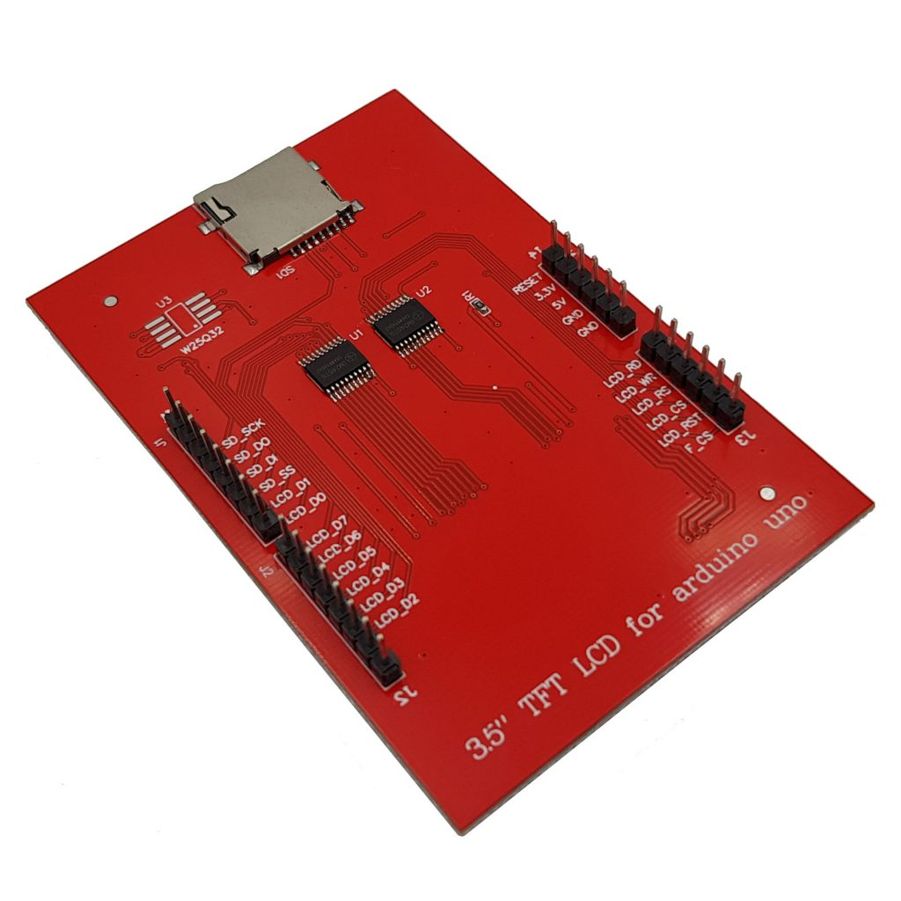
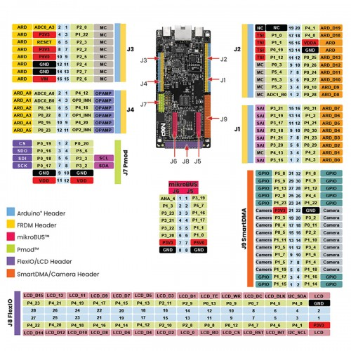

giúp tôi tạo project trong folder này, yêu cầu như sau:
1. proposal:
project này để sử dụng và depploy model AI trên kit nxp mcxn947, model AI nhận diện lấy ảnh từ camera và hiển thị qua màn tft
2. hardware:
- board fdrm-mcxn947
- màn tft ra chân như hình này , tên màn là HSD024131-C1
- camera OV7670
3. nối chân:

như trong hình, camera nối chân  theo phần port camera trên J9SmartDMA
màn tft gắn lên phần chân arduino của board
4. yêu cầu:
1. tạo 1 file readme.md, ghi rõ các chân cắm vào của camera và tft màn
2. viết code init project, tạo một khuôn code để tích hợp model AI về sau, sử dụng tflite/edge impulse
3. code mẫu để test camera thu dữ liệu và hiển thị ra màn hình, tối ưu sử dụng phần cứng của board và mcu này